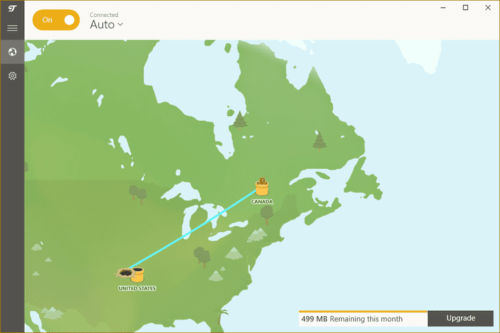
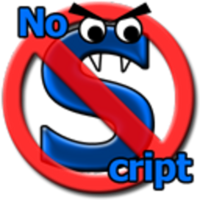
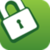

# Complementos básicos para navegar en internet

## ¿Qué son los complementos o extensiones?

Los complementos o extensiones son mini programas para mejorar tu navegador, al añadirlos sumas características y funcionalidades, muchas veces en forma de botón en tu ventana de navegación.

Hay una gran variedad de complementos disponibles para el navegador que uses (Firefox, Chrome,​ Opera​, Safari, Edge) algunos ejemplos de lo que pueden hacer va desde administradores de descargas y pestañas, alertas y actualizaciones, ayuda de idioma, noticias y blogs, compras, desarrollo web, juegos, fotos, música y videos, y también las hay de privacidad y seguridad para una navegación más segura y confiable.

## Antes de instalarlos

Los navegadores tienen tiendas en línea donde puedes encontrar extensiones y ver las más populares. Entre tantas opciones: ¿cuál es la mejor? ¿cual debería de descargar? Antes de instalar cualquiera que te prometa (entre otras cosas) velocidad, facilitarte la vida o recuperar tus pestañas, ten en cuenta:

- Evitar acumular complementos: descargue solo aquellos que necesitas
- Las actualizaciones, si hace tiempo que un complemento no recibe actualizaciones, busca una opción actualizada
- Revisar los permisos y accesos que te pide al instalarlo
- Antes de descargar nuevos complementos, busca reseñas y revisa las calificaciones, quienes desarrollan y qué hacen con la información que obtienen.

Considera que muchas extensiones se sostienen de publicidad y recolección de tus datos y hábitos de navegación.

## 6 Extensiones para navegar de forma más segura y privada en internet

Cada vez que navegamos por Internet vamos dejando pequeños rastros de nuestra actividad, algunos tipos de rastros digitales son las conocidas “cookies”, los archivos caché o archivos temporales.

Los rastros digitales son información almacenada por tu navegador y  recolectada y/o monitoreada por terceros (empresas como Google, Facebook) para hacer un perfil sobre ti y así enviarte anuncios dirigidos.

Cuando nuestros datos son monitoreados pueden revelar bastante información que no queremos que sea vista por cualquiera, por ejemplo, los sitios que hemos visitado, nuestras preferencias de navegación o datos que revelen quién eres, qué te gusta y qué haces... es decir, mucho sobre ti, sobre tu identidad.

Siendo así, ¿es posible navegar de manera más segura y privada en internet?  Además de recomendarte actualizar y revisar la configuración de tu navegador, te sugerimos instalar estos complementos para proteger tu información de una manera más práctica.

### Impedir el rastreo de tu navegación
**Privacy badger**

  

Privacy Badger bloquea anunciantes y otros rastreadores de terceros, evitando que sepan desde donde navegas y qué páginas visitas en la web. Si un anunciante parece rastrearte sin tu permiso a través de varios sitios web, Privacy Badger bloquea al anunciante automáticamente para que no cargue más contenido en tu navegador. Para el anunciante, es como si de repente hubieras desaparecido.

*Disponible para Firefox, Chrome y Opera.*	[https://www.eff.org/es/privacybadger](https://www.eff.org/es/privacybadger)

### Bloquear anuncios y rastreadores
**uBlock Origin**

  

Usualmente uBlock Origin tiene la fama de ser un bloqueador de anuncios, sin embargo en realidad es un “bloqueador de amplio espectro”, que al igual que Privacy Badger se encarga no solo de bloquear anuncios, si no también rastreadores de terceros y sitios que han sido clasificados como malware (es decir, software maliciosos que intentan infectar o atacar a tus equipos).

*Disponible para Firefox, Chrome, Safari y Microsoft Edge.*	[https://github.com/gorhill/uBlock/](https://github.com/gorhill/uBlock/)

Aunque a grandes rasgos pareciera que Privacy Badger y uBlock Origin hacen lo mismo, la verdad es que no, ambos funcionan internamente de manera distinta, por lo que al juntarlos hacen un buen “combo bloqueador”.

### Proteger tu navegación con cifrado HTTPS
**HTTPS Everywhere**

  

HTTPS Everywhere surge de la necesidad de que la información viaje de manera segura y cifrada, actualmente el uso de HTTPS (un  protocolo de comunicación seguro) ha incrementado, sin embargo no todos los sitios lo utilizan de manera apropiada, por lo que HTTPS Everywhere forza a que los sitios cifren la información de manera correcta, así la información siempre tendrá una pequeña “cubierta” que la protege incluso cuando el sitio por sí mismo no lo hace.

*Disponible para Firefox, Chrome y Opera.*	[https://www.eff.org/https-everywhere](https://www.eff.org/https-everywhere)

### Navega de forma segura con una VPN
**TunnelBear**

  

TunnelBear nos permite tener una pequeña VPN (Red Virtual Privada en español), básicamente una VPN permite que nuestra información viaje como si estuviera en un túnel, de manera segura y cifrada, una VPN da la apariencia de que nos encontramos físicamente en otro lugar, el concepto puede parecer un poco complicado, pero basta con observar la siguiente imagen.

  

Basándonos en la imagen, físicamente la persona que está conectada se encuentra en Canadá, sin embargo utiliza una VPN desde Canadá hasta Estados Unidos, por lo que toda su información que viaja hacia Internet pareciera que sale desde Estados Unidos y no de Canadá.

**Disponible para Chrome y Opera.** [https://www.tunnelbear.com](https://www.tunnelbear.com)

### Bloquea elementos no confiables de un sitio web
**NoScript / ScriptSafe**

  

NoScript bloquea la ejecución de código Javascript, Java, Flash, Silverlight y otros tipos de scripts en tu navegador, esto sirve para prevenir que se ejecuten acciones que no queremos en nuestro navegador, (por ejemplo, Facebook tiene un script javascript que actualiza constantemente tu muro) conforme lo vamos utilizando podemos ir añadiendo sitios de confianza a una lista para que estos se ejecuten con plena confianza.

*NoScript, disponible para Firefox.* [https://noscript.net/](https://noscript.net/)

  

Dado que NoScript se encuentra solamente disponible para Firefox, existe una alternativa llamada **ScriptSafe**, al igual que NoScript, previene que se ejecuten elementos en nuestro navegador y nos permite una lista de elementos y sitios de confianza.

*ScriptSafe, disponible para Chrome y Opera.* [https://github.com/andryou/scriptsafe](https://github.com/andryou/scriptsafe)

---

Los complementos aquí mencionados no son los únicos que existen, por lo que te recomendamos que no te detengas solamente con los aquí listados, si encuentras una alternativa que se ajuste más a tus necesidades no dudes en utilizarla y compartirla con nosotros.

---

Esta guía esta alojada en Github y allí está todo el contenido disponible. Puedes hacer sugerencias mediante un "issue".
